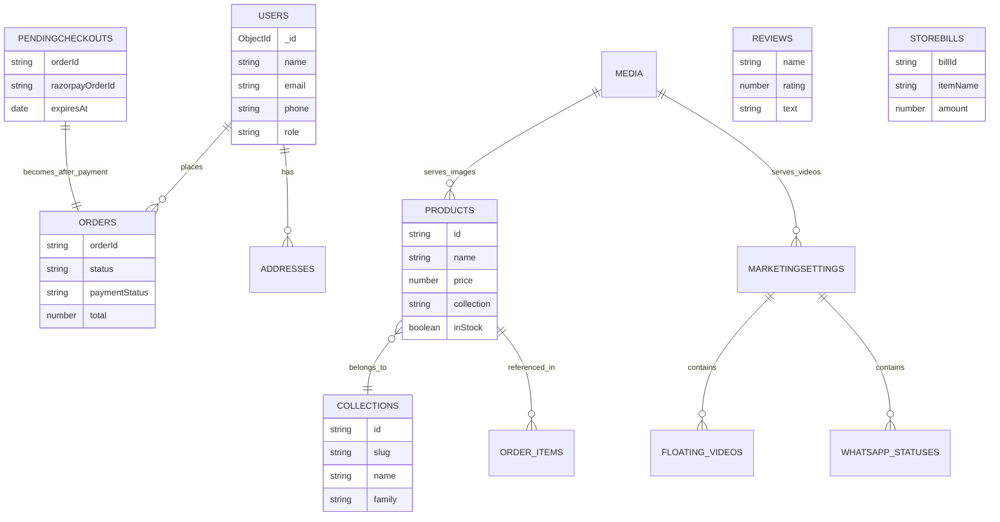

# Database Structure

**Stack:** MongoDB · Mongoose  
**Database:** `h2r-sports`  
**Purpose:** E-commerce reference schema (catalog, users, checkout, orders, marketing, offline billing)

---

## 1. Overview

| # | Collection | Purpose |
|---|------------|---------|
| 1 | `users` | Customers & admins + saved addresses |
| 2 | `products` | Product catalog (sizes, weights, images) |
| 3 | `collections` | Product groupings / editions |
| 4 | `orders` | Paid fulfillment orders only |
| 5 | `pendingcheckouts` | Temporary Razorpay drafts (auto-expire) |
| 6 | `reviews` | Review management (testimonials + moderation) |
| 7 | `marketingsettings` | Floating videos + WhatsApp statuses |
| 8 | `media` | Binary media stored in MongoDB |
| 9 | `storebills` | Walk-in / physical shop sales |

---

## 2. Entity Relationship



---

## 3. Collection Details

### 3.1 `users`

Customer / admin accounts. Password is hashed (bcrypt) before save.

| Field | Type | Required | Notes |
|-------|------|----------|-------|
| `_id` | ObjectId | auto | Primary key |
| `name` | String | ✅ | Full name |
| `email` | String | ✅ | Unique, lowercase |
| `password` | String | ✅ | Hashed |
| `phone` | String | — | 10-digit IN mobile; unique when non-empty |
| `role` | String | — | `customer` \| `admin` (default: `customer`) |
| `addresses` | Address[] | — | Embedded address book |
| `createdAt` | Date | auto | |
| `updatedAt` | Date | auto | |

#### Embedded: `addresses[]`

| Field | Type | Required | Notes |
|-------|------|----------|-------|
| `_id` | ObjectId | auto | Address id |
| `label` | String | — | Home / Work / Other |
| `name` | String | ✅ | Receiver name |
| `phone` | String | ✅ | Delivery phone |
| `addressLine1` | String | ✅ | |
| `addressLine2` | String | — | |
| `city` | String | ✅ | |
| `state` | String | ✅ | |
| `pincode` | String | ✅ | 6-digit PIN |
| `isDefault` | Boolean | — | Default delivery address |

**Indexes**
- `email` → unique  
- `phone` → unique (partial: only when phone is a non-empty string)

---

### 3.2 `products`

Catalog items (bats) with variant sizes & weight ranges.

| Field | Type | Required | Notes |
|-------|------|----------|-------|
| `_id` | ObjectId | auto | |
| `id` | String | ✅ | Public product slug/id (unique) |
| `name` | String | ✅ | |
| `tagline` | String | — | |
| `price` | Number | ✅ | Base / display price (INR) |
| `compareAt` | Number | — | MRP / strike-through price |
| `collection` | String | ✅ | Links to collection id |
| `category` | String | ✅ | |
| `badge` | String | — | e.g. Hot / New |
| `weight` | String | — | Display weight summary |
| `willow` | String | — | |
| `madeIn` | String | — | Default: Tamil Nadu, India |
| `topSelling` | Boolean | — | Home rail flag |
| `mostLoved` | Boolean | — | Home rail flag |
| `inStock` | Boolean | — | Default: `true` |
| `sizes` | Size[] | — | Price variants |
| `weights` | Weight[] | — | Weight range options |
| `features` | String[] | — | Bullet features |
| `images` | String[] | — | URLs / media paths |
| `description` | String | — | |
| `createdAt` | Date | auto | |
| `updatedAt` | Date | auto | |

#### Embedded: `sizes[]`

| Field | Type | Required |
|-------|------|----------|
| `id` | String | ✅ |
| `label` | String | ✅ |
| `price` | Number | ✅ |

#### Embedded: `weights[]`

| Field | Type | Required |
|-------|------|----------|
| `id` | String | ✅ |
| `from` | String | ✅ |
| `to` | String | ✅ |
| `label` | String | ✅ |

**Indexes**
- `id` → unique

---

### 3.3 `collections`

Product editions / families shown on the storefront.

| Field | Type | Required | Notes |
|-------|------|----------|-------|
| `_id` | ObjectId | auto | |
| `id` | String | ✅ | Unique business id |
| `name` | String | ✅ | Display name |
| `slug` | String | ✅ | URL slug (unique) |
| `blurb` | String | — | Short description |
| `family` | String | — | `hard-tennis` \| `soft-tennis` |
| `familyLabel` | String | — | e.g. Hard Tennis |
| `variant` | String | — | |
| `badge` | String | — | |
| `featured` | Boolean | — | |
| `sortOrder` | Number | — | Default: `100` |
| `createdAt` | Date | auto | |
| `updatedAt` | Date | auto | |

**Indexes**
- `id` → unique  
- `slug` → unique

---

### 3.4 `orders`

**Real shop orders** — created only after successful payment verification.

| Field | Type | Required | Notes |
|-------|------|----------|-------|
| `_id` | ObjectId | auto | |
| `orderId` | String | ✅ | Public order id (unique) |
| `status` | String | — | Fulfillment status (see enums) |
| `paymentStatus` | String | — | `pending` \| `paid` \| `failed` \| `refunded` \| … |
| `paymentMethod` | String | ✅ | `razorpay` \| `upi` \| `card` \| `cod` |
| `paymentMeta` | Mixed | — | Gateway raw meta |
| `razorpayOrderId` | String | — | Indexed |
| `razorpayPaymentId` | String | — | |
| `courier` | Object | — | Tracking block |
| `customer` | Object | ✅ | name, phone, email |
| `shipping` | Object | ✅ | Full delivery address |
| `items` | LineItem[] | ✅ | Snapshot of purchased lines |
| `currency` | String | — | Default: `INR` |
| `subtotal` | Number | ✅ | |
| `shippingFee` | Number | — | Default: `0` |
| `discount` | Number | — | Default: `0` |
| `total` | Number | ✅ | |
| `statusTimestamps` | Object | — | Per-stage dates |
| `statusHistory` | Array | — | Audit trail of status changes |
| `createdAt` | Date | auto | |
| `updatedAt` | Date | auto | |

#### Embedded: `customer`

| Field | Type | Required |
|-------|------|----------|
| `name` | String | ✅ |
| `phone` | String | ✅ |
| `email` | String | ✅ |

#### Embedded: `shipping`

| Field | Type | Required |
|-------|------|----------|
| `addressLine1` | String | ✅ |
| `addressLine2` | String | — |
| `city` | String | ✅ |
| `state` | String | ✅ |
| `pincode` | String | ✅ |

#### Embedded: `items[]`

| Field | Type | Required |
|-------|------|----------|
| `id` | String | ✅ | Product id |
| `name` | String | ✅ |
| `sizeId` | String | ✅ |
| `sizeLabel` | String | ✅ |
| `weightId` | String | — |
| `weightLabel` | String | — |
| `price` | Number | ✅ | Unit price |
| `qty` | Number | ✅ | min 1 |
| `lineTotal` | Number | ✅ |

#### Embedded: `courier`

| Field | Type | Notes |
|-------|------|-------|
| `name` | String | Courier company |
| `trackingId` | String | |
| `trackingUrl` | String | |
| `notes` | String | |

#### Embedded: `statusTimestamps`

| Field | Type |
|-------|------|
| `orderedAt` | Date |
| `acceptedAt` | Date |
| `packedAt` | Date |
| `shippedAt` | Date |
| `deliveredAt` | Date |
| `cancelledAt` | Date |

#### Embedded: `statusHistory[]`

| Field | Type | Notes |
|-------|------|-------|
| `from` | String | Previous status |
| `to` | String | New status |
| `changedAt` | Date | |
| `changedBy` | String | Admin / System |
| `note` | String | |

**Status enums**

| Field | Values |
|-------|--------|
| `status` | `ordered` → `accepted` → `packed` → `shipped` → `delivered` · `cancelled` |
| `paymentStatus` | `pending` · `pending_cod` · `paid` · `refunded` · `failed` |
| `paymentMethod` | `cod` · `upi` · `card` · `razorpay` |

**Indexes**
- `orderId` → unique  
- `razorpayOrderId` → indexed

---

### 3.5 `pendingcheckouts`

Temporary payment drafts. **Not** a real order.  
TTL index deletes the document when `expiresAt` is reached (default +24h).

| Field | Type | Required | Notes |
|-------|------|----------|-------|
| `_id` | ObjectId | auto | |
| `orderId` | String | ✅ | Reserved public id (unique) |
| `razorpayOrderId` | String | ✅ | Gateway order id (unique) |
| `amountPaise` | Number | ✅ | Amount in paise |
| `currency` | String | — | Default: `INR` |
| `customer` | Object | ✅ | name, phone, email |
| `shipping` | Object | ✅ | Same shape as Order.shipping |
| `items` | Array | ✅ | Line snapshot |
| `subtotal` | Number | ✅ | |
| `shippingFee` | Number | — | |
| `total` | Number | ✅ | |
| `expiresAt` | Date | — | TTL (`expireAfterSeconds: 0`) |
| `createdAt` | Date | auto | |
| `updatedAt` | Date | auto | |

**Flow**
1. Create `PendingCheckout` + Razorpay order  
2. User pays  
3. Verify signature → create `Order` (`paymentStatus: paid`)  
4. Delete / ignore pending draft  

---

### 3.6 `reviews` — Review Management

Admin-managed storefront testimonials.  
**Public home page** shows only `status: "approved"`.  
**Admin** can create / edit / approve / hide / delete.

| Field | Type | Required | Notes |
|-------|------|----------|-------|
| `_id` | ObjectId | auto | Primary key · used as public `id` |
| `name` | String | ✅ | Reviewer / customer name |
| `text` | String | ✅ | Review body |
| `rating` | Number | — | 1–5 (default: 5) |
| `location` | String | — | City / region label |
| `image` | String | — | Optional photo URL |
| `productId` | String | — | Optional link to `products.id` |
| `productName` | String | — | Display product name |
| `status` | String | — | `pending` \| `approved` \| `hidden` (default: `approved`) |
| `featured` | Boolean | — | Pin higher on home marquee |
| `sortOrder` | Number | — | Lower = earlier (default: 0) |
| `source` | String | — | `admin` \| `seed` \| `customer` |
| `createdAt` | Date | auto | |
| `updatedAt` | Date | auto | |

**Status workflow**

| Status | Meaning | Visible on storefront? |
|--------|---------|------------------------|
| `pending` | Awaiting admin approval | No |
| `approved` | Live testimonial | Yes |
| `hidden` | Soft-removed from public | No |

**Admin API (management)**

| Method | Path | Action |
|--------|------|--------|
| `GET` | `/api/admin/reviews` | List all (optional `?status=`) |
| `POST` | `/api/admin/reviews` | Create review |
| `PUT` | `/api/admin/reviews/:id` | Update / approve / hide |
| `DELETE` | `/api/admin/reviews/:id` | Hard delete |

**Public API**

| Method | Path | Action |
|--------|------|--------|
| `GET` | `/api/reviews` | Approved reviews only (featured first) |

**Indexes**
- `status`
- compound: `{ status, featured, sortOrder, createdAt }`

---

### 3.7 `marketingsettings`

Singleton-style settings document (`key: "default"`).

| Field | Type | Required | Notes |
|-------|------|----------|-------|
| `_id` | ObjectId | auto | |
| `key` | String | ✅ | Unique; default `default` |
| `floatingVideos` | Video[] | — | Mini watch-&-buy players |
| `whatsappStatuses` | Status[] | — | Story-style status strip |
| `createdAt` | Date | auto | |
| `updatedAt` | Date | auto | |

#### Embedded: `floatingVideos[]`

| Field | Type | Required | Notes |
|-------|------|----------|-------|
| `id` | String | ✅ | |
| `title` | String | ✅ | |
| `videoUrl` | String | ✅ | Media URL |
| `instagramUrl` | String | — | |
| `productPath` | String | — | e.g. `/shop/thala-hard` |
| `productName` | String | — | CTA label |
| `productId` | String | — | |
| `active` | Boolean | — | |
| `sortOrder` | Number | — | |

#### Embedded: `whatsappStatuses[]`

| Field | Type | Required | Notes |
|-------|------|----------|-------|
| `id` | String | ✅ | |
| `title` | String | — | |
| `text` | String | — | |
| `mediaUrl` | String | ✅ | |
| `mediaType` | String | ✅ | `image` \| `video` |
| `durationDays` | Number | — | 1–7 |
| `publishedAt` | Date | — | |
| `expiresAt` | Date | ✅ | |
| `ctaText` | String | — | |
| `prefillMessage` | String | — | WhatsApp prefill |
| `active` | Boolean | — | |
| `sortOrder` | Number | — | |

---

### 3.8 `media`

Binary files stored in MongoDB (survives ephemeral disk on Render).

| Field | Type | Required | Notes |
|-------|------|----------|-------|
| `_id` | ObjectId | auto | Used in `/api/media/:id` |
| `filename` | String | — | Original name |
| `contentType` | String | ✅ | MIME type |
| `size` | Number | — | Bytes |
| `data` | Buffer | ✅ | File bytes |
| `createdAt` | Date | auto | |
| `updatedAt` | Date | auto | |

---

### 3.9 `storebills`

Offline / walk-in counter sales (admin store billing).

| Field | Type | Required | Notes |
|-------|------|----------|-------|
| `_id` | ObjectId | auto | |
| `billId` | String | ✅ | Unique bill number |
| `customerName` | String | — | |
| `customerPhone` | String | — | |
| `productId` | String | — | Optional link to catalog |
| `itemName` | String | ✅ | |
| `sizeId` | String | — | |
| `sizeLabel` | String | — | |
| `weightId` | String | — | |
| `weightLabel` | String | — | |
| `qty` | Number | — | min 1 |
| `unitPrice` | Number | — | |
| `discount` | Number | — | |
| `amount` | Number | ✅ | Final amount |
| `paymentMethod` | String | — | `cash` \| `upi` \| `card` |
| `soldAt` | Date | — | Sale timestamp |
| `notes` | String | — | |
| `createdAt` | Date | auto | |
| `updatedAt` | Date | auto | |

**Indexes**
- `billId` → unique  
- `soldAt` → descending  
- `paymentMethod`

---

## 4. Relationships (logical)

| From | To | How |
|------|----|-----|
| `products.collection` | `collections.id` | Soft string reference |
| `orders.items[].id` | `products.id` | Snapshot at purchase time |
| `pendingcheckouts` | `orders` | Converted after payment verify |
| `marketingsettings.*.videoUrl / mediaUrl` | `media._id` | Via `/api/media/:id` paths |
| `products.images[]` | `media` or static paths | URL strings |
| `reviews.productId` | `products.id` | Optional soft link |
| `users.addresses` | checkout shipping | Copied into order at pay time |

> MongoDB does not enforce foreign keys. Integrity is handled in application code.

---

## 5. Checkout Data Flow

```
User selects product
        ↓
Phone gate → User (+ addresses)
        ↓
Address selected
        ↓
PendingCheckout created  +  Razorpay order
        ↓
Payment success + signature verify
        ↓
Order created (paymentStatus = paid)
        ↓
PendingCheckout discarded / expires (TTL)
```

---

## 6. Suggested Indexes Summary

| Collection | Index | Type |
|------------|-------|------|
| `users` | `email` | unique |
| `users` | `phone` | unique (partial) |
| `products` | `id` | unique |
| `collections` | `id`, `slug` | unique |
| `orders` | `orderId` | unique |
| `orders` | `razorpayOrderId` | index |
| `pendingcheckouts` | `orderId`, `razorpayOrderId` | unique |
| `pendingcheckouts` | `expiresAt` | TTL |
| `marketingsettings` | `key` | unique |
| `reviews` | `status` | index |
| `reviews` | `status + featured + sortOrder + createdAt` | compound |
| `storebills` | `billId` | unique |
| `storebills` | `soldAt` | index |

---

## 7. Quick Reference — Document Shapes

```
users
 └─ addresses[]

products
 ├─ sizes[]
 └─ weights[]

orders
 ├─ customer {}
 ├─ shipping {}
 ├─ items[]
 ├─ courier {}
 ├─ statusTimestamps {}
 └─ statusHistory[]

pendingcheckouts
 ├─ customer {}
 ├─ shipping {}
 └─ items[]

marketingsettings
 ├─ floatingVideos[]
 └─ whatsappStatuses[]

collections
reviews
media
storebills
```

---

*Generated from the H2R Sports MongoDB / Mongoose models — use as a client reference for similar e-commerce builds.*
